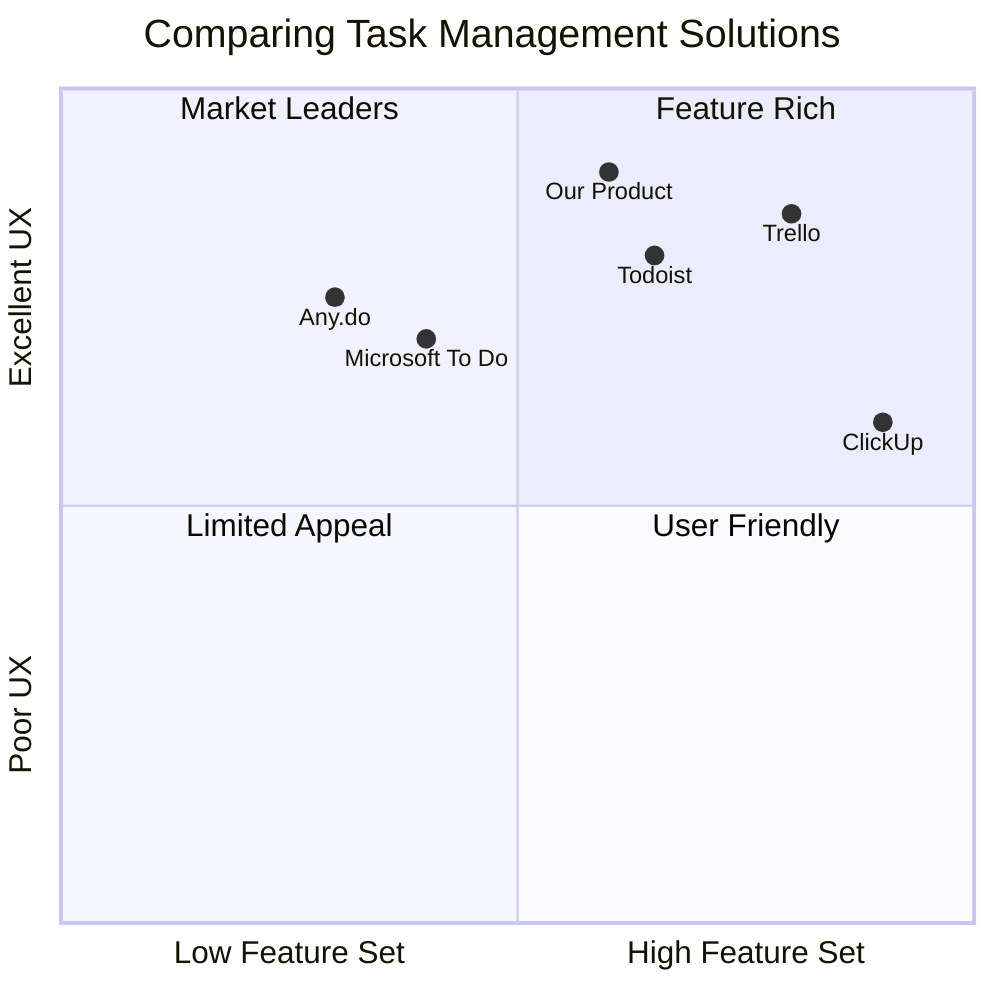

# Personal Task Manager PRD (Product Requirements Document)

## 1. Project Overview

### 1.1 Project Information

- Project Name: personal_task_manager
- Programming Language: Next.js, JavaScript/TypeScript
- UI Framework: Tailwind CSS, Shadcn UI
- Database: SQLite (via PGlite) + Drizzle ORM

### 1.2 Original Requirements

Develop a visually appealing and highly functional web application for managing tasks using a Kanban board interface. The application enables users to efficiently create, organize, and track tasks, utilizing PGlite + Drizzle ORM wrapped in IndexedDB for data persistence, without traditional user login/authentication.

## 2. Product Definition

### 2.1 Product Goals

1. Create an efficient and intuitive task management system that helps users organize their work without the complexity of user authentication
2. Provide a seamless and responsive Kanban board experience with drag-and-drop functionality
3. Deliver a personalized user experience through customizable themes and persistent user preferences

### 2.2 User Stories

1. As a busy professional, I want to quickly create and organize tasks so that I can manage my workload effectively
2. As a visual learner, I want to see my tasks organized in a Kanban board so that I can understand my work progress at a glance
3. As a detail-oriented user, I want to add subtasks and comments to my tasks so that I can break down complex work into manageable pieces
4. As a user with specific visual preferences, I want to customize the application's theme so that I can work comfortably for extended periods
5. As a project manager, I want to track task progress through different stages so that I can monitor project advancement

### 2.3 Competitive Analysis

#### Key Competitors

1. Trello
   - Pros:
     - Intuitive drag-and-drop interface
     - Rich feature set for task management
     - Extensive integration options
   - Cons:
     - Requires account creation
     - Limited free tier features
     - Can become complex for simple use cases

2. Microsoft To Do
   - Pros:
     - Clean, simple interface
     - Good integration with Microsoft products
     - Free to use
   - Cons:
     - Limited visualization options
     - No Kanban view
     - Requires Microsoft account

3. ClickUp
   - Pros:
     - Highly customizable
     - Multiple view options
     - Comprehensive feature set
   - Cons:
     - Steep learning curve
     - Can be overwhelming
     - Requires account creation

4. Todoist
   - Pros:
     - Clean design
     - Cross-platform availability
     - Natural language processing
   - Cons:
     - Limited free features
     - No native Kanban view
     - Requires account

5. Any.do
   - Pros:
     - Simple and intuitive
     - Good mobile experience
     - Calendar integration
   - Cons:
     - Limited customization
     - Basic feature set
     - Premium features locked

6. Our Target Product
   - Pros:
     - No account required
     - Offline-first approach
     - Customizable themes
     - Full-featured Kanban board
     - Completely free
   - Cons:
     - Limited to single device
     - No cloud sync
     - No team collaboration

### 2.4 Competitive Quadrant Chart



## 3. Technical Specifications

### 3.1 Requirements Analysis

#### System Architecture

- Frontend: Next.js application with Tailwind CSS and Shadcn UI
- State Management: Zustand for efficient state handling
- Database: SQLite via PGlite, wrapped in IndexedDB
- Local Storage: User preferences and settings

#### Core Components

1. Initial Setup Module
2. Task Management System
3. Kanban Board Interface
4. Task Details Dialog
5. Dashboard & Navigation

### 3.2 Requirements Pool

#### P0 (Must Have)

1. Initial Setup
   - User name input
   - Theme selection
   - Persistence of preferences

2. Task Management
   - Create new tasks
   - Edit existing tasks
   - Delete tasks
   - Add subtasks
   - Change task status

3. Kanban Board
   - Three columns (Todo, In Progress, Completed)
   - Drag and drop functionality
   - Responsive design
   - Task cards display

4. Task Details
   - View/edit task information
   - Manage subtasks
   - Add comments
   - Update status

#### P1 (Should Have)

1. Theme Customization
   - Multiple color schemes
   - Dark/Light mode toggle
   - System theme detection

2. Dashboard Features
   - Task statistics
   - Recent activities
   - Quick actions

3. Subtask Management
   - Nested subtasks
   - Progress tracking
   - Bulk actions

#### P2 (Nice to Have)

1. Advanced Features
   - Task templates
   - Task prioritization
   - Due date reminders
   - Search functionality

2. UI Enhancements
   - Animations
   - Custom card colors
   - Board customization

### 3.3 UI Design Draft

#### Initial Setup Screen

```
+---------------------------+
|    Welcome to TaskFlow    |
|                           |
|  Enter your name:         |
|  [Name Input Field]       |
|                           |
|  Select Theme:            |
|  [Theme Dropdown]         |
|                           |
|  [Get Started Button]     |
+---------------------------+
```

#### Main Dashboard Layout

```
+---------------------------+
| Logo    Search    Theme   |
+--------+------------------+
|        |                  |
|        |    Kanban Board  |
|  Side  |   +---+---+---+ |
|  Nav   |   |Tod|Prg|Cmp| |
|        |   |   |   |   | |
|Tasks   |   |   |   |   | |
|        |   |   |   |   | |
|        |   +---+---+---+ |
+--------+------------------+
```

#### Task Creation Modal

```
+---------------------------+
|     Create New Task       |
|                           |
| Title: [          ]       |
| Desc:  [          ]       |
| Due:   [Date Pick]        |
| Status:[Dropdown  ]       |
|                           |
| [Cancel]    [Create]      |
+---------------------------+
```

### 3.4 Open Questions

1. Data Management
   - What is the optimal way to structure the IndexedDB schema?
   - How to handle data migration for future updates?

2. Performance
   - How to optimize performance with large numbers of tasks?
   - What are the IndexedDB limitations we need to consider?

3. Feature Scope
   - Should we implement task templates in the first version?
   - How complex should the subtask system be?

4. User Experience
   - How to handle first-time user onboarding?
   - What feedback mechanisms should be implemented?

## 4. Success Metrics

### 4.1 Performance Metrics

- Application load time < 2 seconds
- Task creation/update response time < 100ms
- Smooth drag-and-drop operations (60 fps)

### 4.2 User Experience Metrics

- First-time setup completion rate > 95%
- Task creation success rate > 98%
- Kanban board interaction success rate > 90%

### 4.3 Technical Metrics

- IndexedDB operations success rate > 99.9%
- UI component rendering performance
- Theme switch response time < 50ms

## 5. Future Considerations

### 5.1 Potential Enhancements

1. Data Export/Import functionality
2. Keyboard shortcuts
3. Task templates
4. Advanced filtering and sorting
5. Timeline view

### 5.2 Technical Roadmap

1. Progressive Web App (PWA) support
2. Offline functionality improvements
3. Performance optimizations
4. Accessibility enhancements
